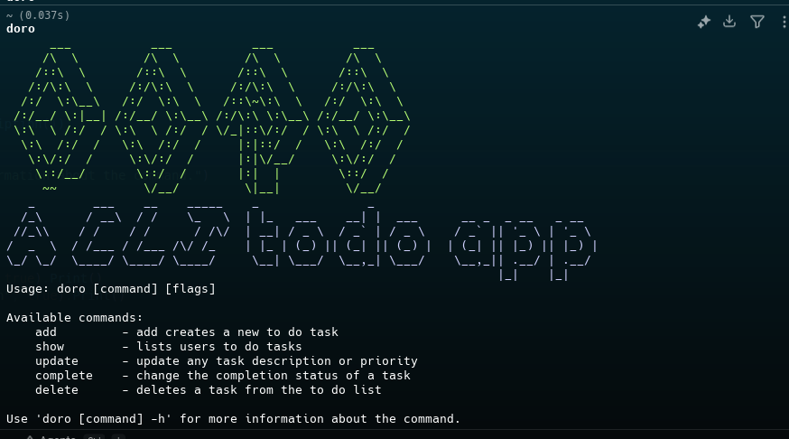

# DORO

A CLI based to-do application written in Go.

### Installation
With go 
> go get github.com/ErebusAJ/doro@latest

Use the released version for direct download

### Working 
> doro [command] [flags]

